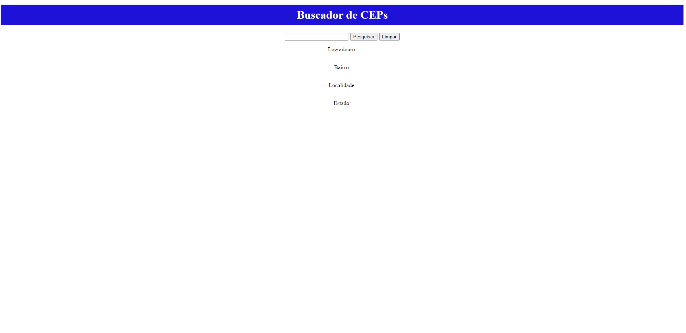

# Projeto de buscar CEPS

Este projeto utiliza uma **API públicas** para buscar CEPs. A API pode se encontrada no link: https://viacep.com.br.

## Desgin do Projeto



## APIs Publicas Usadas

Para buscar um CEP pode-se usar a seguinte URL considerando o cep 62823000 como exemplo:
```
https://viacep.com.br/ws/62823000/json/
```
Resposta da API é a seguinte:
```
cep:"62823-000"
complemento: ""
ddd: "88"
estado: "Ceará"
gia: ""
ibge: "2307007"
localidade: "Jaguaruana"
logradouro: ""
regiao: "Nordeste"
siafi: "1441"
uf: "CE"
unidade: ""
```